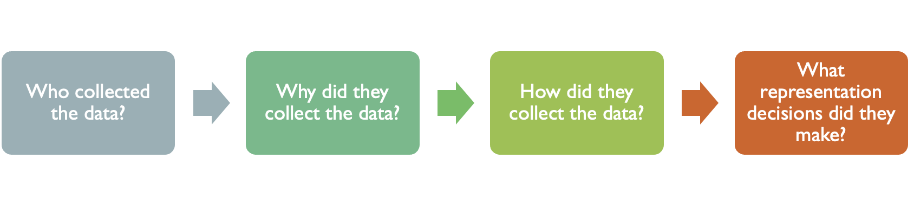

# Group Workshop: Spatial Data Exploration

## Dimensions of Spatial Data

As you learned in the *Introduction to Spatial Data* chapter, spatial data comes from many different sources, exists in a variety of formats, is collected for diverse purposes, and involves numerous representation decisions. It is important to remember that **data is not reality itself**; rather, it is a structured way of representing aspects of reality that can be observed and measured.

You should ask yourself:

Before analyzing any spatial dataset, it is essential to critically evaluate its characteristics. You should consider the following dimensions (non-exhaustive) to determine how the data can be used effectively and what its limitations may be:

| Dimension | Questions to Consider | Analysis Implications |
|----|----|----|
| Purpose | Why was the data collected? Was it collected intentionally for this phenomenon, or is it a byproduct of another activity? | Could the original purpose bias the data or limit what questions it can answer? |
| Sampling | How were locations, events, or people selected? Systematic? Opportunistic? Does it capture an entire population? | Are there gaps or biases that could affect statistical or spatial analysis? |
| Measurement | What is being measured? Direct observation of the phenomenon or an indirect proxy? | Can you analyze the phenomenon itself, or only something related to it? |
| Observer | Who or what produced the observation? Humans, instruments, or automated systems? | How reliable or consistent are the observations? Could observer error or technology limitations affect results? |
| Spatial Coverage | Does the data cover all locations continuously, or only specific points? | Does this limit the scale or type of spatial analysis? |
| Temporal Resolution | Is the dataset a one-time snapshot or updated repeatedly over time? | Can you study trends over time, or only a single period? |
| Processing | How much has the data been transformed from the original observations? Raw, cleaned, aggregated, or modeled? | Could aggregation or modeling introduce artifacts or obscure patterns? |
| Spatial Representation | What type of spatial object is used? Does the spatial representation accurately reflect the real-world feature it represents? | Could the choice of representation obscure patterns or introduce errors? How does the representation limit the types of spatial analyses you can perform? |
| Attribute Representation | What attributes are included, and what units or scales are used? Do the available attributes match your research goals? | How do the types of attributes affect what analyses are possible? |

For each of the following spatial datasets:

1.  [North Carolina Birth Defects Monitoring Program](https://schs.dph.ncdhhs.gov/units/bdmp/index.htm)
2.  [NCDOT 2024 Traffic Segment Average Annual Daily Traffic](https://connect.ncdot.gov/resources/State-Mapping/Documents/NCDOT_2024_Traffic_Segments_Shapefile_Description.pdf)
3.  [Google Covid19 Mobility Data](https://www.google.com/covid19/mobility/)

Your group should systematically evaluate the dataset using the dimensions below. For each dimension, answer the guiding questions and then consider the analysis questions to reflect on how the dataset’s characteristics might influence what you can study. Determine one research question that could reasonably be answered with the dataset and one research question that could not because of a mismatch between the data dimensions and the research goals.

## Hypothesizing Spatial Processes

For each of the following case studies:

1.  [EMS Response times by US County](https://www.researchgate.net/figure/Total-EMS-response-times-among-US-counties-Times-displayed-are-estimated-as-the-NEMSIS_fig1_297675506)
2.  [ELA Proficiency by North Carolina School District](https://statetestscoreresults.substack.com/p/north-carolina-2025-assessment-results)
3.  [Urban Heat Islands in Durham, NC](https://compass.durhamnc.gov/en/compass/AFTERNOON-HEAT-ISLANDS/tract/)

Consider the spatial pattern. Remember that later in the class we will use tests to determine if a spatial pattern exists. For now, use visual interpretation. Describe whether the pattern seems clustered, dispersed, or random. Then hypothesize on both **spatial** and **non-spatial processes** that could contribute to generating the pattern. Consider how the pattern might change at different scales, and identify which processes might be the most relevant at different scales. Finally, reflect on non-stationarity– whether the same process could operate differently in different locations.
