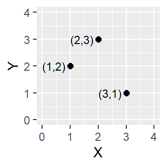
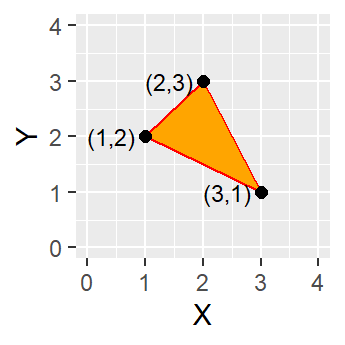
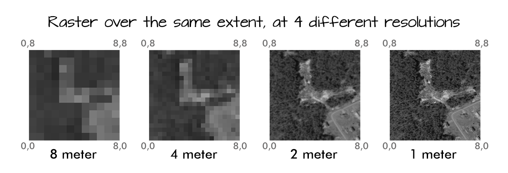
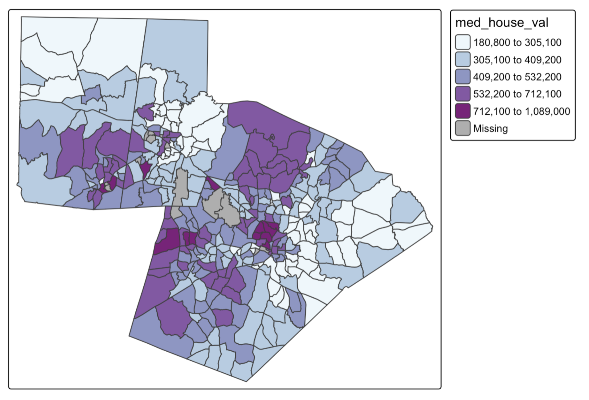
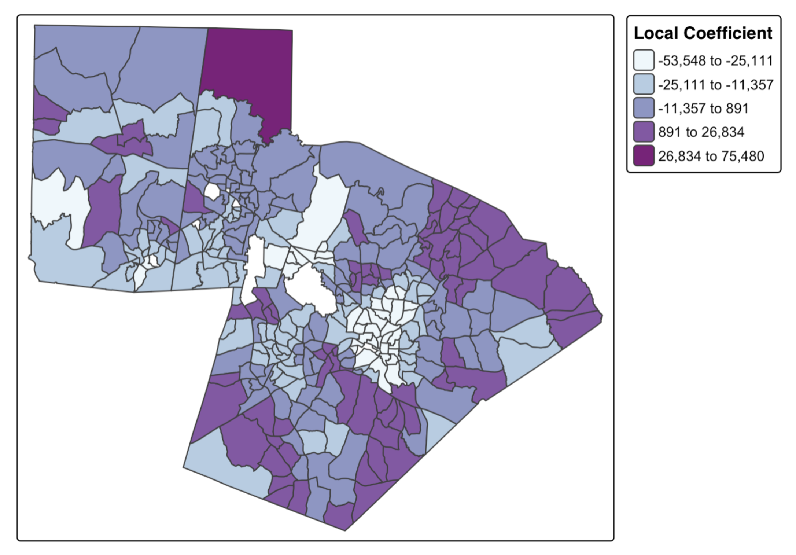

# Introduction to Spatial Data

A common headache in classical statistics is the '[spatial problem](https://courses.ems.psu.edu/geog586/node/641)': the fact that spatial data inherently violates the fundamental assumption of independent observations. Rather than treating this as a problem, **Spatial Data Science** focuses on leveraging the unique characteristics of spatial data to extract more information from data with a locational component. This chapter conceptually introduces the unique components of spatial data, which will set you up to learn how to use these components to gain deeper insights from this type of data.

**REFLECT: Why might "independent observations" be a problem in geography?**

# What is spatial data?

Spatial data is any data that can be tied to a specific location on Earth. In general, spatial data includes both location and attribute components. The location tells us where a feature is in the world and must be represented using a coordinate system, which provides a standardized way of expressing position on the Earth’s surface. The attributes provide additional information about what exists or occurs at that location.

**REFLECT: What is one spatial dataset that you have worked with in the past?**

# Where does spatial data come from?

## Old School Spatial Data

Historically, spatial data was collected almost exclusively by state institutions, militaries, and professional surveyors. These data sources were considered “authoritative” because they relied on credentialed experts, standardized tools, and formal methodologies to achieve a high degree of accuracy. Early data collection involved resource-intensive methods like land surveying (using total stations and reference points), aerial photography for photogrammetry, remote sensing, and field data collection during censuses. The tools were expensive, slow, and required specialized training, but they produced high-quality data with thorough documentation (metadata).

Some of the common sources of “authoritative” spatial data include: 

-   US Census Bureau
    -   Population counts and demographics (e.g., race, age, income)
    -   Housing and economic data
    -   Geographic boundaries (e.g., census tracts, block groups, ZIP code tabulation areas)
-   US Geological Survey (USGS) 
    -   Topographic maps
    -   Elevation and terrain (e.g., DEMs)
    -   Land cover and land use (e.g., NLCD)
    -   Hydrography (rivers, lakes, watersheds)
    -   Geologic and seismic data
-   NASA
    -   Weather and climate data
    -   Coastal and marine mapping (e.g., nautical charts, sea surface temperature)
    -   Flood zones and storm surge models
    -   Fisheries and oceanographic data
-   State and Local Governments
    -   Parcel and zoning data
    -   Transportation networks (roads, transit routes)
    -   Utilities and infrastructure (e.g., water lines, sewer systems)
    -   Land use plans and municipal boundaries
-   EPA
    -   Air and water quality data
    -   Environmental justice mapping (e.g., EJScreen)
    -   Regulated facility locations

## New School Spatial Data

Increasingly, spatial data are generated by non-traditional sources, including individuals, private companies, and automated systems. These data often come as a by-product of everyday activity, social interactions, or commercial operations. They tend to be high-volume, frequently updated, and cover fine-grained temporal and spatial scales. Because of these characteristics, these data are sometimes considered authoritative. 

Some of the common sources of “new school”  spatial data include: 

-   Social Media and User-Generated Content
    -   Geotagged photos 
    -   Check-ins or location tags 
    -   Reviews or comments with location context (e.g. Yelp, Google Reviews)
-   Mobility and Location Data
    -   Smartphone GPS data (from apps or system services)
    -   Cell tower and Wi-Fi data
    -   Ride-sharing and transit service data
-   Commercial and Transactional Data
    -   Credit/debit card transactions
    -   Retail foot traffic and store visit data
    -   E-commerce delivery and logistics data
-   Sensor and IoT Data
    -   Smart city sensors (traffic cameras, parking sensors)
    -   Wearable devices (fitness trackers, health monitors)
    -   Environmental sensors (temperature, air quality, noise)
-   Imagery and Remote Sensing Data (non-governmental)
    -   Satellite imagery from private companies (e.g., Planet Labs, Maxar)
    -   Drone-collected imagery

## Crowdsourced Spatial Data

Collecting spatial data is now easier than ever since almost every smartphone has a built-in GPS.  Intentional spatial data collection by non-experts is often called crowdsourced data. Crowdsourced or community-collected geospatial data has become an increasingly important way to capture information that is intentionally or unintentionally missed by “authoritative” sources. These grassroots efforts often seek to fill data gaps that disproportionately affect marginalized communities. Some well-known examples of crowdsourced data include:

-   OpenStreetMap: A free, crowdsourced map of the world built by millions of contributors, widely used in humanitarian efforts and mapping underserved areas.
-   Mapillary: A platform where users upload street-level imagery to support navigation, urban development, and computer vision training.
-   eBird: A citizen science project where birdwatchers record sightings, contributing to biodiversity monitoring and conservation.
-   iNaturalist: A platform where people document observations of plants and animals, helping scientists track species distribution and ecological change.

**REFLECT: The rise of crowdsourced data has created tension between official and unofficial sources of spatial data. What might this tension tell us about the role of power in data production?**

# Categories of spatial data

Spatial features can be represented in different ways depending on the phenomenon being studied. These representations are models that aim to capture the feature’s real-world form and context. How a feature is represented influences the types of analysis, visualization, and interpretation that are possible. 

## Unmarked Point Data

Unmarked point data consist of points that represent the locations of events or objects, but do not have any additional attributes. In these data, the location itself is inherently meaningful because it is the primary information being captured. Examples include the locations of trees in a park, streetlights along a road, or car accident sites. 

## Marked Point Data

Marked point data consist of points that represent locations with associated attributes or “marks”, which provide additional information about the feature at that location. For example, earthquake epicenters may include magnitude, houses may have assessed property values, or restaurants may include ratings. In this type of data, the location may or may not be meaningful depending on the context. For phenomena like earthquakes or crime, the location itself is important, while for features like weather stations, the location is primarily where the measurement occurs, and the focus is on the attributes.

## Areal Data

Areal data represent spatial features as areas or zones. In some cases, the boundaries themselves are meaningful, such as countries, where the delineation reflects real-world separation. In other cases, the areas are arbitrary aggregations created for analysis purposes, such as census tracts or block groups, where the exact location within the area is not meaningful, but the attributes assigned to the area (e.g., population, income) are. 

## Continuous Surfaces

Continuous surfaces represent phenomena that vary continuously across space and are usually stored in a grid format, where each cell contains a value. In this type of data, the location of individual cells is not inherently meaningful, but the values themselves describe a property of the landscape or environment at that position. Examples include temperature or rainfall maps, digital elevation models, and air pollution concentrations. 

**REFLECT: Consider the case study of forest fires in Western North Carolina. What would be an example of each category of spatial data that might be useful for analyzing residential risk to forest fires?**

# Representing Spatial Data

When translating real-world features into geographic data, there are two main “conceptual” views of the world: the field view and the object view. A field view treats the world as a continuous surface, where each location is associated with one or more attributes (connect to continuous surfaces above). In contrast, an object view conceptualizes the world as made up of discrete entities that have clearly defined boundaries and exist in specific locations (connect to areal data, marked and unmarked points). Between these objects, there can be empty space with no associated features. 

These conceptual models align with two major data models used in spatial data. A vector-based model represents geographic features as sets of points, lines, or polygons. This is well-suited for discrete objects. A raster-based model, on the other hand, represents space as a grid of regularly spaced cells, each containing a value that represents an attribute at that location. This structure is ideal for continuous data, where each cell captures a small piece of a surface.

## Vector data

Vector data is built around geometries, which are encoded into the file. The most basic geometry type is a point. A point is represented as a single coordinate pair (x, y).

Points can then be combined to create lines and polygons. To create a line, at least two distinct points must be connected.

A polygon is created when three or more points are connected which means the starting and ending coordinate pairs must be the same. Of the three basic geometric primitives (point, line, polygon), only polygons have an area.

With vector data, resolution is defined by several conditions: 

1.  The precision of the coordinates
2.  The complexity of the shape (for instance, how many vertices are used to represent the feature)
3.  The minimum mapping unit (MMU). This represents the smallest feature that would be included in the dataset

**REFLECT: Resolution can impact the types of questions we can ask of our spatial data. Come up with an example of a research question and an example dataset where there would be a resolution mismatch.**

## **Common Vector Data File Types**

Shapefile (.shp): By far, the most common vector data file type you’ll encounter when accessing geospatial data is the Shapefile (.shp). This format, which is semi-proprietary (structured and maintained by ESRI), has become the dominant standard. This is not because it offers superior functionality, but because of ESRI’s early dominance in the GIS software market. Shapefiles are a non-topological format made up of several files, including the .shp (geometry), .shx (shape index), .dbf (attribute table), .prj (projection), and sometimes others. 

GeoPackage (.gpkg): GeoPackage is a relatively modern, open-source format developed by the Open Geospatial Consortium (OGC). Built on SQLite, it allows multiple layers and attribute tables to exist within a single .gpkg file, streamlining data management and reducing file clutter. This structure also supports more advanced querying, similar to what’s possible in a relational database– for example, joining attribute tables, filtering by SQL expressions, or performing spatial queries within the file itself. 

GeoJSON (.geojson): GeoJSON is a lightweight, text-based format for encoding vector features using JavaScript Object Notation (JSON). It is especially popular in web mapping environments, where its structure is easily parsed by browsers and APIs. GeoJSON is limited to WGS84 coordinates. 

File Geodatabase (.gdb):The File Geodatabase is a high-capacity, high-performance format developed by ESRI for use with ArcGIS. It stores vector data, rasters, attribute tables, topological rules, subtypes, and more in a structured folder system. This format supports large datasets (into the terabytes), long field names, and complex relationships between layers. While it’s proprietary and not natively supported by all software, it provides powerful data management and analysis capabilities within the ESRI ecosystem. 

**REFLECT: Despite their ubiquity, shapefiles come with serious limitations: a maximum file size of 2 GB, field names limited to 10 characters, and a maximum of 255 fields. Many believe, myself included, that [Shapefile must die!](http://switchfromshapefile.org/) What are some potential benefits of using an open source data format compared to an ESRI product?**

## **Raster Data**

In a raster model, real-life features are represented as an array of pixels. Instead of distinct geometries, a raster is made up of regularly spaced pixels of identical sizes, and each pixel is associated with a value. 

## Resolution in Raster Data

In raster data, resolution refers to the size of each pixel, typically expressed in ground units (e.g., feet or meters). Smaller pixels mean higher resolution, capturing more detail. Most raster sources, such as satellite imagery, have fixed native resolutions determined by the sensor’s capabilities.

**REFLECT: Resolution can impact the types of questions we can ask of our spatial data. Come up with an example of a research question and an example dataset where there would be a resolution mismatch.**

## Common Raster Data File Types

GeoTIFF (.tif): GeoTIFF is the most widely used raster data format for geospatial applications. It’s a standard TIFF image that includes embedded geographic metadata (like coordinate system, bounds, and resolution), making it easy to georeference. GeoTIFFs are versatile, lossless, and widely supported across GIS platforms. They can store single-band or multi-band imagery, making them suitable for satellite images, elevation data, and classified rasters.

NetCDF (.nc): NetCDF (Network Common Data Form) is a format commonly used for storing multidimensional scientific data, such as climate variables or oceanographic models. It supports time-series rasters, multiple dimensions (e.g., x, y, time, depth), and internal compression. NetCDFs are favored in academic and environmental modeling contexts, but can be complex to manage without specialized tools.

# Spatial is Special

## Spatial Dependence

Tobler’s First Law of Geography states that “everything is related to everything else, but near things are more related than distant things”. Spatial dependence arises because the value of a variable at one location is often influenced by nearby locations. Spatial dependence contributes to **spatial patterns**, which describes the structures and patterns that emerge between spatial phenomena, and can be quantified using measures of spatial autocorrelation. 

There are several general processes that cause spatial dependence:

-   Spatial defusion (spillover effects)
    -   Many phenomena spread across space from one location to nearby locations. For example, a new housing development or commercial center may increase property values in surrounding neighborhoods
-   Environmental or Physical Constraints
    -   The environment itself can create spatial dependence. For example, elevation and slope affect where houses can be built and climate determines vegetation zones
-   Social, Economic, or Cultural Processes
    -   Human behavior is often spatially organized because interactions are strongest among nearby individuals. People tend to live near others with similar socioeconomic status, cultural preferences, or lifestyles, which creates clusters of similar social and economic characteristics across space
-   Uncaptured Spatially Structured Variables
    -   Sometimes the variable we’re studying is influenced (see **spatial processes**) by other factors that also vary across space, but those factors are not measured.For example, air pollution levels in a city might be affected by traffic volume, industrial activity, and local wind patterns. Because these unmeasured factors are spatially structured, nearby locations often have similar pollution levels, creating spatial autocorrelation.

**REFLECT: For all of the process types above, come up with an additional example**

Spatial autocorrelation can be strongly positive (which results in a clustered pattern), weak (which results in a random spatial pattern), or strongly negative (which results in a dispersed pattern). 

The map below shows median home value by census tract in the Triangle region of North Carolina. This is an example of areal spatial data without meaningful boundaries, which means that we are interpreting how values, not locations, are associated with each other. Looking at this map, we can determine that there are clear clusters of positive and negative values (i.e. median home value is more similar to nearer locations). However, we are not able to determine the strength of this spatial autocorrelation just using the map, this requires more advanced methodologies. 

{width="527"}

In contrast, many species distributions, especially of territorial species, result in a dispersed spatial pattern. Individuals or groups maintain a certain distance from one another to reduce competition for resources such as food, nesting sites, or mating opportunities. Examples include wolves, foxes, and certain bird species, where each territory is spaced to minimize overlap with neighbors.

If spatial autocorrelation is weak, it means that nearby locations are not consistently similar or dissimilar. This can happen when the underlying process is essentially random, when the factors influencing it are not spatially structured, or when multiple processes with opposing effects cancel each other out. Measurement or scale issues can also weaken apparent spatial dependence; for example, aggregating data over large regions can mask local patterns, making the distribution appear random.  

## Spatial Non-Stationarity

Spatial patterns are caused by a combination of non-spatial and spatial processes. A spatial process is a mechanism, or set of mechanisms, that operate through space. This means that the location, proximity, or connectivity of features matters for how the process operates (i.e. the process itself **DEPENDS** on spatial relationships).  This differs fundamentally from a non-spatial process, in which the outcome is independent of location or spatial arrangement. 

Taking our example of median home value, we could consider several potential spatial processes that result in the clustered spatial pattern– proximity effects (value of a home is influenced by nearby properties) and accessibility (homes closer to transit, downtown areas, or commercial hubs are more valuable). However, the pattern will also be influenced by non-spatial processes, such as home size, home age, and home quality. 

What is important to note about spatial processes is that they are **non-stationary**. This means that the way that a process operates can change across space, which means that the relationships, mechanisms, or effects observed in one location might not be the same in another location. Recognizing non-stationarity is crucial for spatial analysis because it means that models that assume a uniform process (global models) might not accurately capture spatial dynamics. 

Going back to our example of home value, one hypothesized spatial process would be proximity to employment. We can use a **Geographically Weighted Regression** to explore how the relationship between these two variables vary across space. A geographically weighted regression creates a local regression model for each location by using nearby observations weighted by distance. We can use average commute as a proxy for proximity to major employment centers. The map below shows the coefficient of the GWR at different locations across the Triangle. This coefficient represents the local association between commute time and median home value, indicating how the relationship differs between the urban core and surrounding suburban areas. Negative coefficients in the central city suggest that longer commute times are associated with lower home values, reflecting the premium placed on accessibility, while positive coefficients in suburban areas suggest that longer commutes are associated with higher home values, likely capturing trade-offs between housing size, affordability, and distance from employment centers.

{width="509"}

**REFLECT: Residential tree canopy cover is another spatial pattern that is usually clustered. Hypothesize on some non-spatial and spatial processes that might contribute to clustering, and how they might be non-stationary.**

## Scale Effects

Spatial processes also differ across scales. For instance, we can consider that there are spatial processes at the local, city, or state level that might influence home value. At the local level, processes such as neighborhood clustering of high-amenity areas, street connectivity, or proximity to parks can influence home values. At the city level, processes like zoning, transit accessibility, or distribution of commercial centers shape housing prices across neighborhoods. At the state or regional level, spatial processes include the distribution of economic hubs, in-migration, and  regional commuting flow. Because spatial processes differ across scales, analysis must account for scale to accurately capture the mechanisms influencing space.

**REFLECT: Think about tree canopy coverage at different scales (neighborhood, city, county). How might the spatial processes differ across scales?**

## Special Issues: Modifiable Areal Unit Problem

Individual (or point-level) spatial data is often aggregated to areal units. This happens for several reasons:

-   Privacy
    -   Aggregating data protects sensitive information about individuals by reporting only summary values for larger areas
-   Data availability
    -   Some data are only measured or published at aggregated levels
-   Analytical convenience
    -   Aggregating data reduces complexity and makes spatial analysis more computationally manageable
-   Alignment with policy or planning units
    -    Many decisions (for instance, in urban planning, public health, or transportation) are made at administrative or political boundaries

While aggregating data is often necessary or useful, it introduces the Modifiable Areal Unit Problem (MAUP), where the choice of spatial units (size or boundaries) can influence statistical results and spatial patterns. These results can change significantly depending on how the boundaries are drawn (zone effect) and how large or small the units are (scale effect).

Consider the summary statistics for percent poverty across North Carolina zip codes vs. counties to see the impact of the scale effect:

|                  |       |        |       |       |         |
|------------------|-------|--------|-------|-------|---------|
| Aggregation Unit | Mean  | Median | Min   | Max   | St. Dev |
| Zip Code         | 25.33 | 23.76  | 0     | 100   | 13.82   |
| County           | 26.46 | 25.48  | 12.34 | 40.83 | 6.58    |

Aggregating data into larger units can smooth out local variation and reduce variability. For example, comparing the standard deviation at the zip code (13.82) to the county (6.58) shows that smaller units capture more heterogeneity. 

Because of the MAUP, we need to be careful when interpreting aggregated data, given that patterns observed at one scale or within a particular zoning scheme may not hold at another. Since spatial patterns are often scale-dependent, one way to mitigate the effects of the MAUP is to align the selection of areal units with the hypothesized scale of the underlying process. Robustness can also be assessed by comparing results across similar spatial units– for example, examining patterns at the census block group level versus the census tract level, or testing slightly different zoning schemes. Additionally, advanced methods such as hierarchical or multiscale modeling can explicitly account for variations across scales, providing a more accurate understanding of spatial dynamics.

**REFLECT: Consider the research question: To what extent does socioeconomic status determine a neighborhood's proximity to a full-service grocery store? What would be concerns about how the MAUP might affect our analysis, and how could we minimize the MAUP?**
